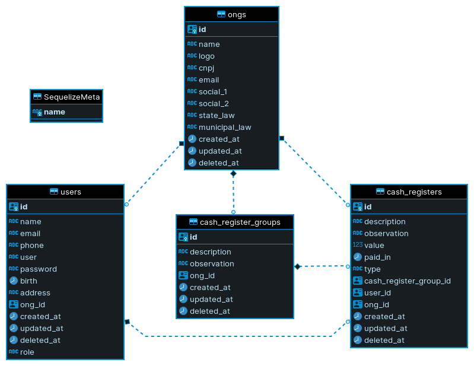

# MOCO
Este é o backend ([front] aqui) de um projeto que tem o objetivo de atender necessidades no controle de caixa, como cadastrar, listar e gerar relatório sobre movimentação em períodos específicos. Esta API foi construída em [Node.js] com uso de [TypeScript] e [Postgres] (através do ORM [Sequelize]).

## Arquitetura
Abaixo está o modelo entidade relacionamento do projeto.



## Requisitos
- [Node.js] - Node.js na versão 14 ou superior;
- [Postgres] - Instância do banco de dados Postgres;
- [Sendgrid] key - Para enviar emails de recuperação de senha, é necessário uma chave de acesso na plataforma Sendgrid;
- Cliente HTTP - Um aplicativo cliente para executar requisições HTTP, como [Postman];
- [Docker] e [Docker-compose] (OPCIONAL) - O projeto possui possibilidade de ser executado em um container [Docker], juntamente com uma instância do banco [Postgres].

## Instalação
Após clonar este projeto, crie um arquivo chamado **.env** no diretório **/src/enviroments/**, usando como referência o arquivo .env.example localizado no diretório citado (caso pretenda utilizar o método Container Docker para subir o ambiente, ignore as variáveis do banco de dados). Em seguinda, existem duas formas de executar a API, descritas abaixo.

### Container Docker
Como apresentado na seção de Requisitos, este projeto possui a possibilidade de ser executado em um container docker. Para isso, na raíz deste projeto, através de seu terminal de comandos, execute o comando *docker-compose up -d* e aguarde até que os containers sejam construídos e executados, disponibilizando o acesso à API no endereço **http://localhost:3001/api**. Serão criados e executados 3 containers através deste compose: uma instância do banco Postgres, o cliente PgAdmin4 para acesso ao banco de dados e o servidor para dar acesso à API. Caso deseje criar apenas o container do servidor, pode executar o comando *docker build -t moco-api .* para criar uma imagem do servidor e em seguida, o comando *docker run -it -p 3001:3001 moco-api* para que seja criado e executado um container desta imagem.

### Em seu ambiente Node.js
Para executar o projeto em seu ambiente, através terminal de comandos apontando para a raíz do projeto, execute o comando *npm install* para que as dependências necessárias sejam baixadas e em seguida, execute o comando *npm run migrate:apply* para criação das tabelas no banco de dados e em seguida, execute *npm run dev* para que o projeto seja executado, disponibilizando o acesso à API no endereço **http://localhost:3001/api**.

É importante ressaltar que em ambas as formas de "subir" a API, não existem dados iniciais no banco, como ONGs e usuários. Para facilitar o desenvolvimento e testes, há um conjunto de "seeds" neste projeto para popular o banco inicialmente. Para executá-los, execute o comando *npm run seed:apply*.

## Utilização
Caso esteja utilizando o cliente HTTP [Postman], pode acessar [este link] para baixar uma coleção que contém as rotas disponíveis nesta API.
Caso tenha executado os seeds descritos na seção de Instalação, pode-se logar com o usuário criado com as seguintes informações:

```json
{
    "user": "admmaster",
    "password": "1234"
}
```

## Contato
welingtonfidelis@gmail.com
<br>
Sugestões e pull requests são sempre bem vindos 🤓 

License
----

MIT

**Free Software, Hell Yeah!**

[GitHub_API]: <https://docs.github.com/en/rest>
[Node.js]: <https://nodejs.org/en/>
[TypeScript]: <https://www.typescriptlang.org/>
[Postgres]: <https://www.postgresql.org/>
[Sequelize]: <https://sequelize.org/master/>
[Docker]: <https://docs.docker.com/get-started/>
[Docker-compose]: <https://docs.docker.com/compose/install/>
[Postman]: <https://www.postman.com/downloads/>
[Sendgrid]: <https://sendgrid.com/>
[este link]: <https://www.getpostman.com/collections/22ae9313e8dc888b343f>
[front]: <https://github.com/welingtonfidelis/moco_front>
